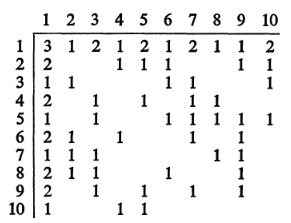

# Housing Reallocation

## Motivation
A housing authority manages public housing. The needs of the families that live in the public housing change over time. As a family grows, they may want more bedrooms or garage space. At the same time, as children grow up and move out, a family may need less bedrooms. Yet, other families may just want to move to a different part of the city to be closer to work. To account for these adjustments, the housing authority wants to develop a system to efficiently reassign the housing units so that as many of these families get re-assigned to their preferred unit type. 

## Technical Details
We can frame this problem as a network optimization problem. In this section, we give an overview of the technical implementation. 

We begin by capturing all of the preferred exchanges with the requirements matrix $A$. Each row and column corresponds to a type of housing unit. For example, a sample of descriptions include the following:

| Beds | Garages | Rent | Zone |
| - | - | - | - |
| 3 | 1 | Medium | Outer Zone C |
| 4 | 2 | High | Inner Zone A |
| 3 | 0 | Low | Middle Zone F |
| 2 | 1 | Medium | Middle Zone F |
| 5 | 1 | High | Zone G |

Given these descriptions, we define $a_{ij}$ as the number of tenants in unit type $i$ that wish to move to unit type $j$. The one provided as an example in the paper is the following: 

```python 
# Requirements Matrix
A = [
    [0, 6, 0, 7, 0, 3, 0, 6, 5, 0],
    [0, 0, 0, 3, 17, 12, 0, 0, 9, 7],
    [8, 4, 0, 0, 0, 8, 10, 0, 0, 5],
    [0, 0, 8, 0, 3, 0, 7, 0, 0, 0],
    [6, 0, 4, 0, 0, 10, 6, 5, 10, 0],
    [0, 22, 0, 8, 0, 0, 3, 4, 6, 0],
    [6, 7, 13, 0, 0, 0, 0, 0, 8, 0],
    [0, 9, 5, 0, 0, 6, 0, 11, 6, 0],
    [0, 0, 5, 0, 16, 0, 19, 0, 0, 4],
    [7, 0, 0, 5, 4, 0, 0, 0, 0, 0]
]
```

We define a corresponding _distance matrix_, $D$, which encodes whether or not a direct exchange can be made. That is, $d_{ij} = 1$ if $a_{ij} > 0$, and $d_{ij} = \infty$ otherwise. We can calculate it with the following code: 

```python 
def initial_distance_matrix(A):
    """
    DESCRIPTION: finds shortest number of moves between 
        housing categories. 
    """
    n = len(A)
    D = np.full((n, n), float('inf'))

    for i in range(n):
        for j in range(n):
            # non-empty
            if A[i][j] > 0 and A[i][j] < float('inf'):
                D[i][j] = 1

    return D
```

Therefore, the corresponding matrix $D$ for the above $A$ is 

```python 
D = [
  [inf,  1., inf,  1., inf,  1., inf,  1.,  1., inf],
  [inf, inf, inf,  1.,  1.,  1., inf, inf,  1.,  1.],
  [ 1.,  1., inf, inf, inf,  1.,  1., inf, inf,  1.],
  [inf, inf,  1., inf,  1., inf,  1., inf, inf, inf],
  [ 1., inf,  1., inf, inf,  1.,  1.,  1.,  1., inf],
  [inf,  1., inf,  1., inf, inf,  1.,  1.,  1., inf],
  [ 1.,  1.,  1., inf, inf, inf, inf, inf,  1., inf],
  [inf,  1.,  1., inf, inf,  1., inf,  1.,  1., inf],
  [inf, inf,  1., inf,  1., inf,  1., inf, inf,  1.],
  [ 1., inf, inf,  1.,  1., inf, inf, inf, inf, inf]
]
```

While $D$ allows for direct exchanges, it's possible to shuffle tenants around to satisfy more housing unit exchanges. For example, we can exchange tenants from unit type 1 to 2, but we can satisfy more tenants by shuffling them through a longer _circuit_ such as 1-3-2 and 1-5-2 since there may be tenants in other housing types that want to move to housing type 2. 

However, to do that, we need a more sophisticated definition of $D$. We define $D'$ as a matrix where each element encodes the shortest distance from $i$ to $j$. We can obtain such a matrix using the Floyd-Warshall algorithm. 

```python 
def floyd_warshall(distance_matrix):
    """
    DESCRIPTION: finds the shortest distance between every node
    """
    n = len(distance_matrix)
    dist = np.array(distance_matrix, dtype=float)
    next_node = [
        [None if dist[i][j] == float('inf') else j 
        for j in range(n)] for i in range(n)
    ]

    for k in range(n): # node k is intermediate node
        for i in range(n):
            for j in range(n):
                if dist[i][k] + dist[k][j] < dist[i][j]:
                    dist[i][j] = dist[i][k] + dist[k][j]
                    next_node[i][j] = next_node[i][k]  # Update path 

    return dist, next_node
```

Obviously, by using the Floyd-Warshall algorithm, the diagonals will have a distance of 0. For our purposes, we will redefine it as the shortest circuit. That is, the shortest path back to itself with length greater than 0. This is a useful value to have because circuits represent ways to shuffle tenants so that supply is preserved (we cannot create or destroy units), yet the tenants will receive their preferred housing type. 

```python 
def cycle_diagonals(D_prime, A):
    """
    Adjusts the diagonal entries of D_prime to reflect shortest cycle lengths,
    by checking only arcs (i - j) that actually exist in A.
    """
    n = len(D_prime)
    D_cycle = D_prime.copy()
    for i in range(n):
        min_cycle_len = float('inf')
        for j in range(n):
            if i != j and A[i][j] > 0 and D_prime[j][i] < float('inf'):
                cycle_len = 1 + D_prime[j][i]
                if cycle_len < min_cycle_len:
                    min_cycle_len = cycle_len
        D_cycle[i][i] = min_cycle_len
    return D_cycle
```

We begin by defining these terms: 

```python 
# Initialize Distance Matrix
D = initial_distance_matrix(A)
D_prime, _ = floyd_warshall(D)
D_prime = cycle_diagonals(D_prime, A) # modify diagonals
```

### Searching for Circuits
```python 
D_prime = [
  [3., 1., 2., 1., 2., 1., 2., 1., 1., 2.],
  [2., 2., 2., 1., 1., 1., 2., 2., 1., 1.],
  [1., 1., 2., 2., 2., 1., 1., 2., 2., 1.],
  [2., 2., 1., 3., 1., 2., 1., 2., 2., 2.],
  [1., 2., 1., 2., 2., 1., 1., 1., 1., 2.],
  [2., 1., 2., 1., 2., 2., 1., 1., 1., 2.],
  [1., 1., 1., 2., 2., 2., 2., 2., 1., 2.],
  [2., 1., 1., 2., 2., 1., 2., 2., 1., 2.],
  [2., 2., 1., 2., 1., 2., 1., 2., 2., 1.],
  [1., 2., 2., 1., 1., 2., 2., 2., 2., 3.]
]
```
Each diagonal element of $D'$ represents the shortest path to itself. For example, in the above matrix, the circuit of node 1 has a length of $D'_{11} = 3$. One example of such a circuit is 
$$
1-2-5-1. 
$$
Now that we have identified a viable circuit, we can begin moving tenants around. We see that $A_{12}=6$, $A_{25}=17$, $A_{51}=6$, so the bottleneck is $\min\{A_{12}, A_{25}, A_{51}\} = 6$. In other words, we can move 6 tenants around to their preferred housing unit. 

Once we move them, we can re-adjust the requirements matrix so $A_{12} \leftarrow A_{12} - 6 = 0$, $A_{25} \leftarrow A_{25} - 6 = 11$, and $A_{51} \leftarrow A_{51} - 6 = 0.$ Now since some of the requirements have been zeroed out, we must also adjust the distance matrix to reflect this: $D'_{12} = D'_{51} = \infty$. 

We can summarize this shuffling of tenants as follows: 
1. find shortest circuit of length $k$
2. identify bottleneck in circuit 
3. shuffle tenants and adjust demand by the bottleneck

In code, we have the following functions: 
```python 
def find_all_paths_of_length_k(A, D_prime, start, end, k):
    """
    Finds all k-length circuits
    """
    n = len(A)
    results = []

    def dfs(path, visited, length_so_far):
        u = path[-1]

        if u == end and length_so_far == k:
            results.append(path[:])
            return

        if length_so_far >= k:
            return  # avoid overstepping

        for v in range(n):
            if A[u][v] > 0 and (v not in visited or v == end):
                path.append(v)
                visited.add(v)
                dfs(path, visited, length_so_far + 1)
                path.pop()
                visited.discard(v)

    dfs([start], {start}, 0)
    return results

def get_bottleneck_demand(path, A):
    """
    Finds the maximum number of tenants we can shuffle on an arc
    """
    return min(A[i][j] for i, j in zip(path[:-1], path[1:]))

def adjust_circuit_flow(A, path, demand):
    """
    Shuffles tenants and readjusts demand 
    """
    for i, j in zip(path[:-1], path[1:]):
        A[i][j] -= demand
        if A[i][j] == 0:
             D_prime[i][j] = float('inf')
```

Now, we have found all ways to shuffle tenants along a $k$-length circuit. To complete our problem, we must consider every $k$-length circuit (e.g. 10 in our example). Then, we do the same for every circuit starting and ending at node $s$. In code, we write

```python 
def extract_circuits_length_k(A, D_prime_masked, s, k):
    for t in range(len(A)):
        paths = find_all_paths_of_length_k(A, D_prime_masked, t, s, path_len - 1)
        for path in paths: 
            if path is None:
                continue         
            else: 
                path = [s] + path

            # find bottleneck demand and adjust flow
            demand = get_bottleneck_demand(path, A)
            adjust_circuit_flow(A, path, demand)
            if demand > 0: 
                print(f"Path: {path}; {demand} Sets")

# Begin Program
D = initial_distance_matrix(A)
D_prime, _ = floyd_warshall(D)
D_prime = cycle_diagonals(D_prime, A)
while np.any((diag != 0) & (np.diag(D_prime) != float('inf'))): 

    # Find Shortest path
    diag = np.diag(D_prime)
    mask = (diag != 0) & (diag != float('inf'))  
    s = int(np.argmax(mask))
    path_len = int(D_prime[s][s])
    D_prime_masked = masked_distance_matrix(D_prime, s)
    extract_circuits_length_k(A, D_prime_masked, s, path_len - 1)

    # Update Distance Matrix
    D = initial_distance_matrix(A)
    D_prime, _ = floyd_warshall(D)
    D_prime = cycle_diagonals(D_prime, A)
```

## Results

The paper considers the following requirements matrix: 
```python
A = [
    [0, 6, 0, 7, 0, 3, 0, 6, 5, 0],
    [0, 0, 0, 3, 17, 12, 0, 0, 9, 7],
    [8, 4, 0, 0, 0, 8, 10, 0, 0, 5],
    [0, 0, 8, 0, 3, 0, 7, 0, 0, 0],
    [6, 0, 4, 0, 0, 10, 6, 5, 10, 0],
    [0, 22, 0, 8, 0, 0, 3, 4, 6, 0],
    [6, 7, 13, 0, 0, 0, 0, 0, 8, 0],
    [0, 9, 5, 0, 0, 6, 0, 11, 6, 0],
    [0, 0, 5, 0, 16, 0, 19, 0, 0, 4],
    [7, 0, 0, 5, 4, 0, 0, 0, 0, 0]
]
```

After running this algorithm, these are the results (note that these are 0-indexed, which may differ from some other parts of the report): 

```python
Path: [0, 1, 4, 0]; 6 Sets
Path: [0, 3, 2, 0]; 7 Sets
Path: [0, 5, 6, 0]; 3 Sets
Path: [0, 7, 2, 0]; 1 Sets
Path: [0, 8, 6, 0]; 3 Sets
Path: [0, 8, 9, 0]; 2 Sets
Path: [0, 7, 1, 9, 0]; 5 Sets
Path: [1, 5, 1]; 12 Sets
Path: [1, 3, 2, 1]; 1 Sets
Path: [1, 3, 6, 1]; 2 Sets
Path: [1, 4, 2, 1]; 3 Sets
Path: [1, 4, 5, 1]; 8 Sets
Path: [1, 8, 6, 1]; 5 Sets
Path: [1, 8, 2, 5, 1]; 2 Sets
Path: [1, 8, 4, 7, 1]; 2 Sets
Path: [1, 9, 4, 7, 1]; 2 Sets
Path: [2, 6, 2]; 10 Sets
Path: [2, 5, 7, 2]; 4 Sets
Path: [2, 5, 8, 2]; 2 Sets
Path: [2, 9, 4, 2]; 1 Sets
Path: [2, 9, 3, 6, 2]; 3 Sets
Path: [2, 9, 4, 8, 2]; 1 Sets
Path: [3, 4, 5, 3]; 2 Sets
Path: [3, 4, 7, 5, 3]; 1 Sets
Path: [3, 6, 8, 9, 3]; 2 Sets
Path: [4, 8, 4]; 9 Sets
Path: [4, 6, 8, 4]; 5 Sets
Path: [6, 8, 6]; 1 Sets
```

These results closely align with those in the paper. I've tried to investigate exactly why this is, but it ultimately comes down to a difference in $D'$. For example, the paper suggests the matrix should be



However, upon close inspection, we see $D'_{5,10} = 1$ when $A_{5,10} = 0$. How is it possible to move from housing unit type 5 to housing unit type 10 in one move when no tenants in housing type 5 want to move to housing type 10? I'm inclined to believe that there are slight typos in the original paper and these typos result in downstream differences in the calculation between the paper and my analysis. Nevertheless, the similarities between my analysis and the paper are significant. Therefore, we have provided a faithful implementation of the network optimization problem of housing reallocation.

## References
Wright, J. W. (1975). Reallocation of Housing by use of Network Analysis. Journal of the Operational Research Society, 26(2), 253–258. https://doi.org/10.1057/jors.1975.59


